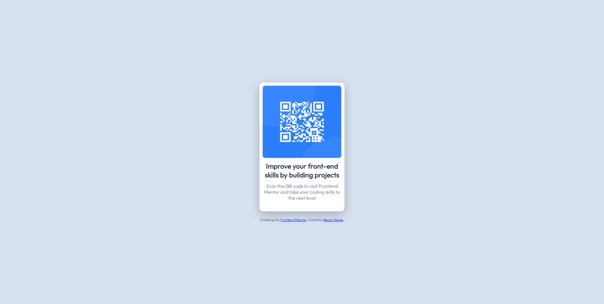

# QRCode-Component

Esta é minha solução para o [desafio do componente de código QR no Frontend Mentor](https://www.frontendmentor.io/challenges/qr-code-component-iux_sIO_H).

## Índice

- [Visão geral](#visão-geral)
   - [Captura de tela](#captura-de-tela)
- [Processo de Desenvolvimento](#meu-processo)
 
 
## Visão Geral
Projeto executado para estudo e pratica da minipulação de documentos HTML e CSS

## Captura de Tela
 - DESKTOP

 - MOBILE

## Processo de Desenvolvimento
Projeto desenvolvido com as seguintes tecnologias
 - HTML 
 - CSS
 - FLEXBOX